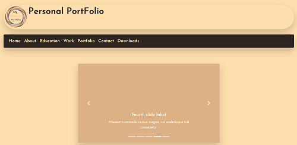

# Mweus Ukurasa 


This is my *official website* that is aimed at showcasing my talents, creativity and learning with regards to *web development*. helping you understand words and expressions that are commonly used by sheng speakers.

The site can be navigated using the 5 major navigation links below:
```
 Home
 Portfolio
 Tutorials
 Contact
 blog 
```

## UX

As a user I want to my *wesbsite* to be easy to navigate, clearly labelled and intuitive in order to facilitate a pleasant *user experience*.

This is [Mweus Ukurasa Site PDF Mockup](assets/images/screenshots/mweus-ukurasa-screenshots-of-site-layout.pdf) of how the site looks. 


## Features

### The Colour palettes and Font Families for this site are as shown below:

```
/* ----------------------- General styling */

* {
    margin: 0;
    padding: 0;
}

h1, h2, h3, h4, h5, h6 {
    color: #fff8dc;
    font-family: 'Markazi Text', serif;
    text-align: center;
}

a {
    font-family: 'Markazi Text', sans-serif;
}

a:link {
   color: #FAFAD2;
   text-decoration: none;
}

a:visited {
    color: #FAFAD2;
}

a:hover {
    opacity: 0.5;
}

a:active {
    color: #7CfC00;
}

p {
    color: #FAFAD2;
    font-family: 'josefin sans', sans-serif;
    line-height:1.6;
    text-align: center;
    padding-top: 10px;
}

i {
    color: #fff8dc;
}

hr {
    border-bottom: 3px solid #fff8dc;
}

strong {
    color: #FAFAD2;
    font-family: 'Markazi Text', sans-serif;
    line-height:1.6;
    text-align: center;
}

em {
    color: #FAFAD2;
    line-height:1.6;
}


body {
    background-color: #281030;
    font-family: 'Josefin Sans', sans-serif;
    font-size: calc(14px + (20 - 14) * ((100vw - 300px) / (1600 - 300)));
    line-height:1.6;
}

```

### Google Fonts

[Google Fonts](https://fonts.googleapis.com/css2?family=Cormorant+Garamond:wght@700&family=Josefin+Sans:wght@300&family=Markazi+Text:wght@500&display=swap)

```
Fonts Families:
    - Josefin Sans
    - Markazi Text
    - Cormorant Garamond
```

#### General Page Layout

Below is the General Page Layout:

```
 <!DOCTYPE html>
<html lang="en">

<head>
    <!-- Meta links -->
    <meta charset="UTF-8">
    <meta name="viewport" content="width=device-width, initial-scale=1.0, shrink-to-fit=no">
    <meta name="Description" content="This is a personal website showcasing my talents, skills and knowledge in my journey as a Web Developer.">
    <script data-ad-client="ca-pub-6343169593553881" async src="https://pagead2.googlesyndication.com/pagead/js/adsbygoogle.js"></script>
    <!-- Import Google Fonts -->
    <link rel="preload stylesheet" href="https://fonts.googleapis.com/css2?family=Cormorant+Garamond:wght@700&family=Josefin+Sans:wght@300&family=Markazi+Text:wght@500&display=swap">
    <!-- Title content -->
    <title>Mweu's Ukurasa - Home</title>
    <meta name="theme-color" content="#281030">
    <link rel="shortcut icon" href="assets/images/favicon/favicon.svg" sizes="32x32" type="image/svg+xml">
    <link rel="apple-touch-icon" href="assets/images/favicon/favicon.svg" sizes="120×120, 152×152, 167×167, 180x180" type="image/svg+xml">
    <!-- stles.css -->
    <link rel="preload stylesheet" href="assets/css/styles.css" type="text/css">
</head>

<body>
    <!-- Header content starts here -->
    <header>
        <a href="index.html">
            
        </a>
    </header>
    <!-- Header content ends here -->
    <!-- Nav content starts here -->
    <nav>
        <ul>
            <li><a href="index.html"><i class="fas fa-home"></i> Home</a></li>
            <li><a href="portfolio.html"><i class="fas fa-briefcase"></i> Portfolio</a></li>
            <li><a href="tutorials.html"><i class="fas fa-photo-video"></i> Tutorials</a></li>
            <li><a href="contact.html"><i class="fas fa-address-book"></i> Contact</a></li>
            <li><a href="blog.html"><i class="fas fa-blog"></i> Blog</a></li>
        </ul>
    </nav>
    <!-- Nav content ends here -->
    <br>
    <!-- Main content starts here -->
    <main>
        <article id="portfolio-page-access">
            <h2>Portfolio Page</h2>
                <p>
                    To access my <em>portfolio</em> press the button below.
                </p>
                <br>
                <p style="padding: 30px;">
                    <a class="button-customization" href="portfolio.html" role="button"
                        aria-pressed="false">Portfolio</a>
                </p>
        </article>
        <article id="tutorials-page-access">
            <h2>Tuorials Page</h2>
                <p>
                    To access <em>tutorials</em> press the button below. 
                </p>
                <br>
                <p style="padding: 30px;">
                    <a class="button-customization" href="tutorials.html" role="button"
                        aria-pressed="false">Tutorials</a>
                </p>
        </article>
        <article id="blog-page-access">
            <h2>Blog Page</h2>
                <p>
                    To access my <em>blog</em> press the button below. 
                </p>
                <br>
                <p style="padding: 30px;">
                    <a class="button-customization" href="blog.html" role="button"
                        aria-pressed="false">Blog</a>
                </p>
        </article>
    </main>
    <!-- Main content ends here -->
    <br>
    <!-- breadcrum nav content starts here -->
    <article class="breadcrum">
        <ul>
            <li><a href="index.html">Home</a></li>
            <i class="fas fa-grip-lines-vertical"></i>
            <li><a href="portfolio.html">Portfolio</a></li>
            <i class="fas fa-grip-lines-vertical"></i>
            <li><a href="about.html">About</a></li>
            <i class="fas fa-grip-lines-vertical"></i>
            <li><a href="blog.html">Blog</a></li>
        </ul>
    </article>
    <!-- breadcrum nav content ends here -->
    <br>
    <!-- Links content starts here -->
    <article class="social-links">
        <ul>
            <li>
                <a class="twitter" target="_blank" rel="noreferrer" href="https://twitter.com/mweu_m">
                    <i class="fab fa-2x fa-twitter" style="color: #55acee;" aria-hidden="true"></i>
                </a>
            </li>
            <li>
                <a class="linkedin" target="_blank" rel="noreferrer"
                    href="https://www.linkedin.com/in/mweu-ngolia-321692167/">
                    <i class="fab fa-2x fa-linkedin-in" style="color: #2867b2;" aria-hidden="true"></i>
                </a>
            </li>
            <li>
                <a class="github" target="_blank" rel="noreferrer" href="https://github.com/madibamndev?">
                    <i class="fab fa-2x fa-github" style="color:#ffffff;" aria-hidden="true"></i>
                </a>
            </li>
        </ul>
    </article>
    <!-- Links content ends here -->
    <br>
    <!-- Footer content starts here -->
    <footer>
        <p style="text-align: center;">
            <!-- copyright content starts here -->
            <small>&#169; COPYRIGHT 2020</small>
            <!-- copyright content ends here -->
        </p>
    </footer>
    <!-- Footer content ends here -->
    <br>
    <!-- fontawesome script -->
    <script async defer src="https://kit.fontawesome.com/f44776f444.js" crossorigin="anonymous"></script>
</body>
</html>
```

### Existing Features


#### Portfolio Page

Feature 1 (Project Gallery) &mdash; *allows the user to see the see the screenshot of a project as well as a link to the project.*

```
 <section>
    <h3>Project 1</h3>
    <figure id="personal-portfolio-site-wrapper">
        
        <figcaption>
            <a href="https://madibamndev.github.io/personal-portfolio-site/" target="_blank" rel="noreferrer">
                <i class="fas fa-link" style="color: #F40F02;"> <strong>Personal PortFolio Site</strong></i>
            </a>
        </figcaption>
    </figure>
</section>
```

#### Tutorial Page

Feature 2 (Tutorial Videos) &mdash; *allows the user to see a tutorial video.*

```
<section>
    <h3>Using Visual Studio Code</h3>
    <video preload="auto" width="500" controls poster="assets/videos/thumbnails/visual-studio-code.mp4.png">
        <source src="assets/videos/visual-studio-code.mp4" type="video/mp4">
        <source src="assets/videos/visual-studio-code.oggtheora.ogv" type="video/ogg">
        <source src="assets/videos/visual-studio-code.webmhd.webm" type="video/webm">
        <source src="assets/videos/visual-studio-code.webmsd.webm" type="video/webm">
        Your browser doesn't support HTML5 video tag.
    </video>
    <p>
        <strong>Description:</strong> Code editor of choice. Installation, overview, shorcuts,
                    extentions, customizations and general use.
    </p>
    <p>
        link to
            <a href="https://code.visualstudio.com/" target="_blank" rel="noreferrer">
                <i class="fas fa-paperclip" style="color: #F40F02;"></i> Visual Studio Code
            </a>
         official website.
    </p>
</section>
```

### Features Left to Implement

```
 Forms
 Content
 Music
 Tutorials
 Events
```

## Technologies Used in this Build

- [Materialize](https://materializecss.com/getting-started.html) &mdash; The Front-End web Framework used

- [Google Fonts](https://fonts.google.com/?query=jost&sidebar.open=true&selection.family=Josefin+Sans|Jost:wght@500) &mdash; The Font Families used

- [Heroku](https://www.heroku.com/) &mdash; Application Deployment

- [Python](https://www.python.org/downloads/) &mdash; Programming Language

- [Flask](https://flask.palletsprojects.com/en/1.1.x/) &mdash; Microframework written in Python

- [Stack Overflow](https://stackoverflow.com/) &mdash; Troubleshooting

- [MongoDB Atlas](https://www.mongodb.com/cloud/atlas) &mdash; Back-End NoSQL Database

- [Visual Studio Code](https://code.visualstudio.com/) &mdash; Editor used

## Testing

- [Testing Flask Applications](https://flask.palletsprojects.com/en/1.1.x/testing/#:~:text=Flask%20provides%20a%20way%20to,with%20your%20favourite%20testing%20solution.) &mdash; Used for testing

- [CSS Validator](http://www.css-validator.org/) &mdash; Validating CSS files

- Automated browser Testing [Google Lighthouse ext](https://developers.google.com/web/tools/lighthouse#devtools) 

- Testing was also conducted manually whereby friends and family browsed clicked the link sent and navigated through the site on various devices and gave their feedback in the process of making this site. 

- [Materialize Media Queries](https://materializecss.com/grid.html) allows me to stack the content into a single column on smaller devices such as smartphones; single and double columns on tablets and single, double or more columns on larger devices.


## Deployment

In order to deploy the application to heroku [Heroku](https://www.heroku.com/) read the following guidelines on how to [Deploy Python Flask App on Heroku](https://www.geeksforgeeks.org/deploy-python-flask-app-on-heroku/).

In order to deploy your site to [GitHub](https://github.com/) read the following guidelines on [Getting Started with GitHub Pages](https://guides.github.com/features/pages/). 

## Credits

### Content


- Below are examples of *Flask Applications* used as inspiration for my project 
* [Flask Mongo Task Manager](https://github.com/Code-Institute-Solutions/flask-mongo-task-manager) 
* [Flask Blog](https://github.com/CoreyMSchafer/code_snippets/tree/master/Python/Flask_Blog)
* [Flask Tutorial](https://github.com/pallets/flask/tree/1.1.2/examples/tutorial)


### Media

The image placeholder slides used in this project are in the SVG format and were drawn by myself using adobe Xd. Equally the logo is also in SVG format and was designed by myself using Adobe Illustrator. 

### Acknowledgements

My biggest inspiration with this project is to create my own personal website that will showcase my progress in the field of *Web Development* as I continue adding more content and making improvements to the site. 